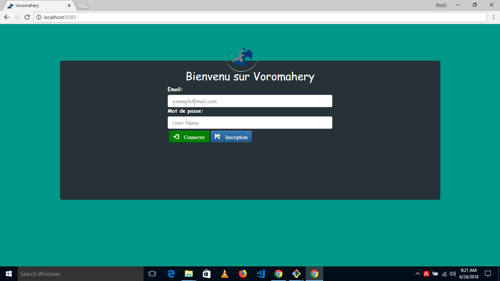

## Ankoay (Voromahery)

Social network build with love on: mongodb, expressjs and socket.io

## Installation of dependencies
> npm install

## Installation of Mongodb
Please install mongodb [here](https://www.mongodb.com/download-center#community)

# Run
> npm start # work only on MINGW

## Run other terminal
\* each command in different terminal separately
> mongod --port 27017 --dbpath ./data

> node app.js

## Screenshot

